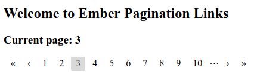
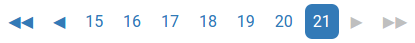

# ember-pagination-links
[](https://travis-ci.org/mikeu/ember-pagination-links)
[](https://opensource.org/licenses/MIT)

**Simple pagination links for ember applications.**

This Ember addon creates a simple set of pagination-style links, based on a
given count of page numbers to display at once and the number of the final
page. It includes navigation arrows for moving to the next and previous pages,
and optionally to the first and last pages as well. When the user clicks on
a page number, that value will be passed to an action you supply.

The `pagination-links` component does not manage the data to be displayed on
each page. It is independent of any data store or fetching strategies. You
tell the component how many pages you would like the user to be able to access,
and the component in turn tells you each time the user clicks on a new page
number. It is up to you then how to present the new page, and what models or
other information should be displayed.

## Examples

### Defaults



### Styled



## Installation

Install the addon within your Ember project:

```bash
ember install ember-pagination-links
```

## Usage

Define an action to be called when the user changes pages:
```js
export default Ember.Controller.extend({
  actions: {
    setPage (newPage) {
      Ember.set(this, "applicationPage", newPage);
    },
  },
});
```

Add a set of pagination links to your template:
```hbs
{{pagination-links
    lastPage=42
    goToPage=(action 'setPage')
}}
```

### Options

The following options can be passed to the `pagination-links` component
to configure it:

#### Required

* `lastPage` (integer): Highest page number to include.
* `goToPage` (callback): Function to call when the user changes pages.

#### Optional

* `width` (integer, default `10`): Maximum number of page numbers to display.
* `currentPage` (integer, default `1`): Page number to display initially.
* `firstPageIcon` (string, default `"«"`): Text of the link to the first page.
* `prevPageIcon` (string, default `"‹"`): Text of the link to the previous page.
* `nextPageIcon` (string, default `"›"`): Text of the link to the next page.
* `lastPageIcon` (string, default `"»"`): Text of the link to the final page.
* `showFirstAndLast` (boolean, default `true`): Whether to include links to the
                                                first and last pages.
* `overflow` (string, default `undefined`): Behaviour of `currentPage` when it
                                            becomes greater than `lastPage`.
                                            See *Overflow behaviour* below.

### Overflow behaviour

There are circumstance under which the current page value in the pagination
links can become greater than the last page value. Two common examples would be
when the user deletes enough entries from the end of the list that the last
page decreases, or when the list is filtered so that there are now fewer
pages of content than there used to be.

The two most likely responses to such an overflow are to jump to the first or
to the last page in the list. If you want one of these two occur automatically,
you can specify `overflow="first"` or `overflow="last"` when creating the
`{{pagination-links}}` component.

Alternatively, you can omit the `overflow` parameter and handle this case
yourself by binding the `currentPage` parameter to a controller property.
Then when you change the last page value, you can update the current page
in whatever manner you please at the same time:

```hbs
{{! /app/templates/my-page.hbs}}
{{pagination-links
    currentPage=currentPage
    lastPage=lastPage
    goToPage=(action 'setPage')
}}
```
```js
// /app/controllers/my-page.js
// ...inside controller definition
  filterTheList () {
    // Perform filtering logic.
    // Get new last page.
    const lastPage = Ember.get(this, "lastPage");
    // Set the current page to half-way through the list.
    Ember.set(this, "currentPage", Math.ceil(lastPage / 2));
  }
// ...
```

### Styling

Each `pagination-links` component is wrapped in a `div` with a class of
`.pagination-links`. Within this `div` live anchor tags with classes that
denote their purpose:

* `a.pagination-links-first`, link to the first page (if displayed).
* `a.pagination-links-last`, link to the last page (if displayed).
* `a.pagination-links-prev`, link to the previous page.
* `a.pagination-links-next`, link to the next page.
* `a.pagination-links-page`, link to a specific page number.
* `a.pagination-links-current`, the current page.

Additionally, the `first`, `last`, `prev` and `next` links may have the class
`.disabled` in the case that they are not clickable (for instance, you cannot
go to the previous page when already on the first page).

#### Example

The highlight of the current page in the styled example above can be achieved
with the following CSS:

```css
div.pagination-links a.pagination-links-current {
  color: #fff;
  background-color: #337ab7;
  padding: 0.5rem;
  border-radius: 7px;
}
```

## Issues

Please use the [issue tracker](https://github.com/mikeu/ember-pagination-links/issues)
to report any problems you encounter using this addon.

## Development

* `git clone https://github.com/mikeu/ember-pagination-links.git`
* `cd ember-pagination-links`
* `npm install`

### Running

* `ember serve`
* Visit the dummy test app at [http://localhost:4200](http://localhost:4200).

### Running Tests

* `npm test` (Runs `ember try:each` to test your addon against multiple Ember versions)
* `ember test`
* `ember test --server`

### Building

* `ember build`

For more information on using ember-cli, visit [https://ember-cli.com/](https://ember-cli.com/).
